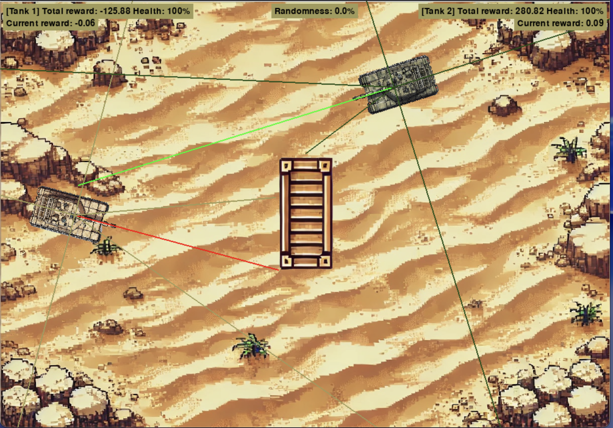

# Tanks RL

A PyTorch-based Reinforcement Learning environment and training pipeline for a 2D tank combat game. 



## Overview

This project implements a custom 2D environment using Pygame and trains AI agents to control tanks. The agents learn to navigate, aim, and shoot an opponent while avoiding obstacles. It uses a custom RL architecture combining an Actor network and a Dueling Critic network.

## Architecture

- **State Space**: 33-dimensional vector including relative positions, health, ammo, raycasts (lasers) for obstacle/opponent detection, and line-of-sight tracking.
- **Action Space**: 18 discrete combinations comprising movement (forward, backward, none), rotation (left, right, none), and firing (yes, no).
- **Agent Model** (`tanks_model.py`):
  - **Actor**: Predicts categorical probabilities for the 18 action combinations.
  - **Critic**: Dueling architecture predicting State Value `V(s)` and Advantage `A(s,a)` to compute `Q(s,a)`.
- **Training Strategy** (`tanks_agent.py` & `tanks_train.py`):
  - Uses a short-term memory (on-policy) and a long-term replay buffer (off-policy).
  - Rewards are given for hitting the enemy, keeping them in line of sight, and penalized for taking damage, looking at obstacles, or being stuck against walls.

## Project Structure

- `tanks_game.py`: The Pygame environment wrapper. Computes states, evaluates actions, and applies rewards. 
- `tanks_game_objects.py`: Defines the entities (Tank, Bullet, Block) and collision logic.
- `tanks_agent.py`: The RL agent managing the Actor/Critic networks, optimizers, and memory buffers.
- `tanks_model.py`: PyTorch definitions for the neural networks.
- `tanks_train.py`: The main training loop that runs episodes and executes optimization steps.
- `tanks_visualization.py`: Utilities for logging metrics and generating training plots.
- `no_pygame_optimization.py`: A custom lightweight `Rect` implementation to bypass Pygame processing during headless training.
- `tanks_no_brain_bot.py`: A rule-based dummy bot used for exploration or as a baseline opponent.
- `tanks_paths.py`: Configuration for paths, asset loading, and rendering toggles.

## Usage

### Training
Configure `RENDERING` and hyperparameters in `tanks_paths.py` and `tanks_train.py`, then run:

```bash
python tanks_train.py
```

This script runs the training loop, saves model checkpoints, and exports visualizations.

### Manual Play
You can test the game manually via `tanks_game.py`:

```bash
python tanks_game.py
```

- **Player 1**: `Z` (Forward), `S` (Backward), `A` (Rotate Left), `E` (Rotate right), `F` (Fire).
- **Player 2**: `UP` (Forward), `DOWN` (Backward), `L` (Rotate Left), `M` (Rotate right), `K` (Fire).
